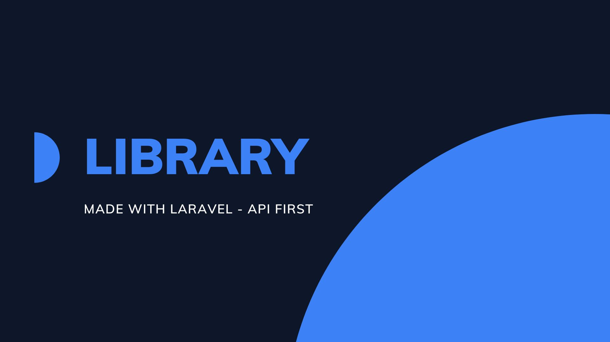
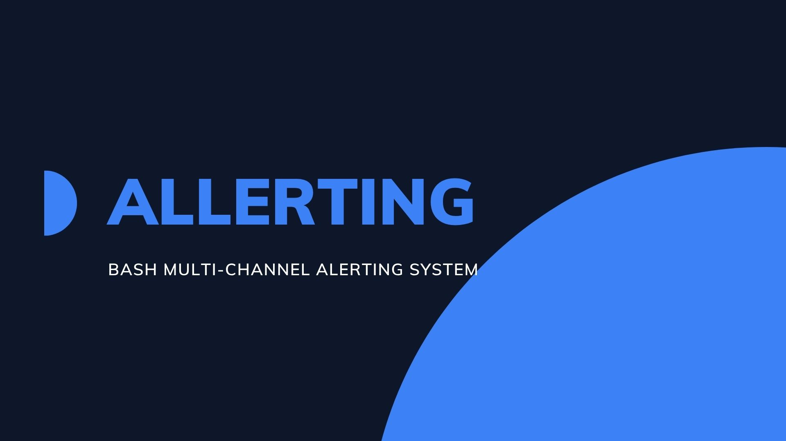

 

---

## Chi Sono

Sviluppo sistemi backend, REST API e applicazioni full stack utilizzando JavaScript e Python.

Focus su:
- clean architecture
- sistemi scalabili
- sviluppo modulare
- applicazioni manutenibili

---

## Stack Tecnologico

### Linguaggi

  
  
  
  
  
  

### Frontend

  
  
  

### Backend

  
  
  
  
  

### Database & DevOps

  
  
  
  
  
  
  
  

---

## Progetti in Evidenza

### Node Todo List

REST API progettata con una struttura backend modulare e un'organizzazione scalabile del progetto.

#### Stack
`Node.js` `Express` `REST API`

---

### Laravel Todo List

Applicazione full stack per la gestione di task sviluppata con Laravel e Blade.

#### Stack
`Laravel` `PHP` `MVC`

---

### Laravel Library

Applicazione API-first per la gestione di libri, autori e categorie con modellazione relazionale e autenticazione.

#### Stack
`Laravel` `Sanctum` `REST API`

---

### Bash Multi-Channel Alerting System

Sistema di notifiche e alerting multi-canale sviluppato in Bash, progettato per automatizzare l'invio di avvisi attraverso diversi canali di comunicazione.

#### Stack
`Bash` `Linux` `Automation` `Alerting`

---

## Statistiche GitHub

---

## Contatti

---

